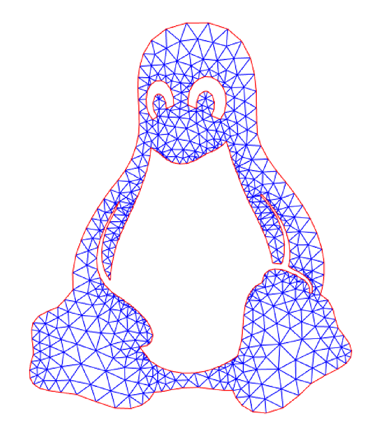

# MATLAB code for generating a mesh from a bitmap image

This **MATLAB** code generates a **mesh** from a black and white **bitmap image**:
* Find the contour of a black and white bitmap image (raster)
* Simplify the contour with a specified tolerance
* Mesh the shape (handling of holes and multiple domains)

This code uses the MATLAB PDE toolbox and generatates a FEM mesh (FEMesh object).
However, the mesh can be used for other purposes that FEM simulations, such as 3d printing.

Look at the example [run_example.m](run_example.m) which generates the following mesh:

    
    

## Compatibility

* Tested with MATLAB R2018b.
* Required the image_toolbox (for contour detection).
* Required the map_toolbox (for contour simplification).
* Required the pde_toolbox (for meshing).
* Compatibility with GNU Octave not tested but probably problematic.

This code share some files with [laser_cut_matlab_slicer](https://github.com/otvam/laser_cut_matlab_slicer).

## Author

**Thomas Guillod** - [GitHub Profile](https://github.com/otvam)

## License

This project is licensed under the **BSD License**, see [LICENSE.md](LICENSE.md).
